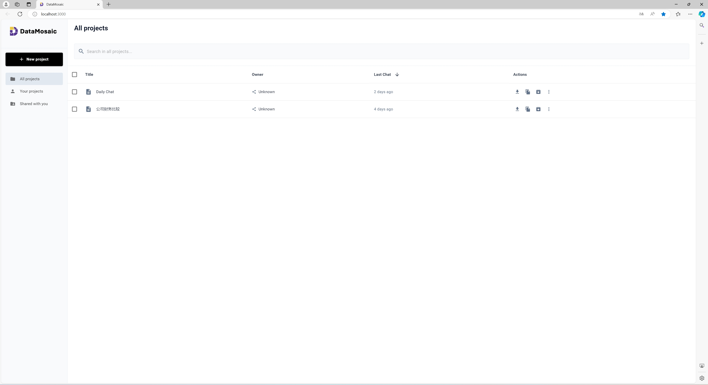
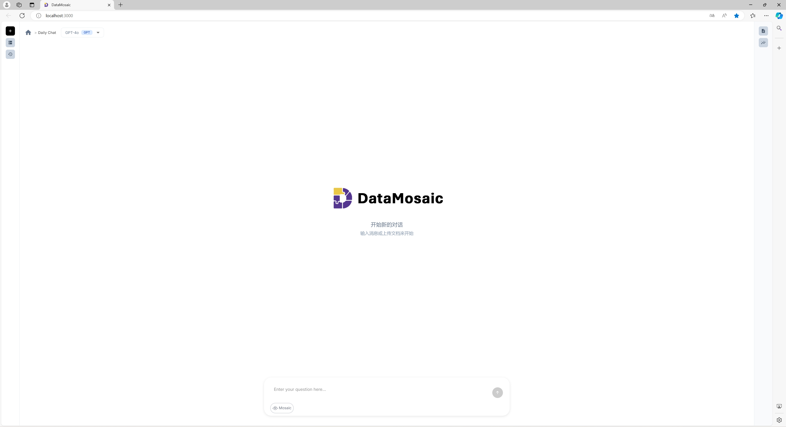
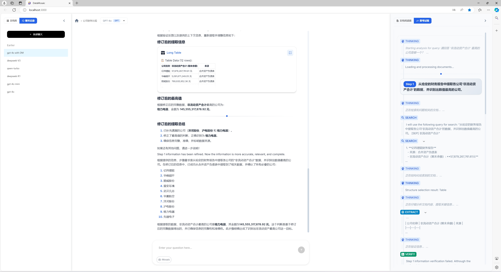

# DataMosaic: Explainable and Verifiable Document-Based Data Analytics

[](https://arxiv.org/abs/2504.10036)
[](https://opensource.org/licenses/MIT)

DataMosaic is an explainable and verifiable document-based data analytics framework powered by Multi-Agent systems and Large Language Models (LLM). The system provides transparent, step-by-step reasoning traces through the Extract-Reason-Verify methodology, with support for verification of intermediate results.

> **Note**: This is a simplified version of the complete DataMosaic system. The core algorithms have been streamlined for easier deployment and usage, while maintaining the essential multi-agent pipeline architecture.

## 📚 Related Papers

The academic paper corresponding to this project has been published on arXiv:

**[DataMosaic: Explainable and Verifiable Multi-Modal Data Analytics through Extract-Reason-Verify](https://arxiv.org/abs/2504.10036)**

*Authors: Zhengxuan Zhang, Zhuowen Liang, Yin Wu, Teng Lin, Yuyu Luo, Nan Tang*

## 🌟 Key Features

- 📄 **Document-Focused Analytics**: Specialized for analyzing various document formats including PDF, Word, Excel, text files, etc.
- 🤖 **Multi-Agent Pipeline**: Complete multi-agent system with Planner, Retrieval, Extraction, Reasoning, and Thinking agents (simplified version)
- 📊 **Document Q&A System**: Intelligent document question-answering based on LangChain
- 💬 **Text Query Support**: Currently supports text-based queries for document analysis
- 🎯 **Explainable Reasoning**: Provides transparent reasoning processes and step tracking
- ✅ **Result Verification**: Supports verification of intermediate results and error detection
- 🖥️ **Web Interface**: Modern user interface based on React
- 🔄 **Streaming Processing**: Supports real-time streaming responses
- 📁 **Multiple Document Formats**: Supports PDF, Word, Excel, and other formats

## 📸 System Screenshot








## 🏗️ Project Architecture

```
DataMosaic/
├── document_qa/              # Core document Q&A module
│   ├── agents/              # Multi-agent system (simplified)
│   │   ├── thinking_agent.py    # Main reasoning agent
│   │   ├── retrieval_agent.py   # Document retrieval agent
│   │   ├── reasoning_agent.py   # Logic reasoning agent
│   │   └── ...              # Other specialized agents
│   ├── core/                # Core workflow and document management
│   └── utils/               # Utility functions
├── document_chat_app/        # Web application
│   ├── frontend/            # React frontend
│   └── backend/             # Flask backend
├── llm/                     # Large language model integration
├── document_qa_main.py      # Main entry file
└── requirements.txt         # Python dependencies
```

### Current Implementation Status

This simplified version focuses on:
- **Document Processing**: Efficient loading and indexing of various document formats
- **Text-based Querying**: Support for natural language questions about document content
- **Multi-agent Coordination**: Streamlined agent pipeline for document analysis
- **Web Interface**: Complete web application for document upload and querying

## 🛠️ System Requirements

### Software Requirements
- **Python**: 3.8+ 
- **Node.js**: 16+ 
- **npm**: 8+

### Hardware Recommendations
- **Memory**: 8GB+ RAM
- **Storage**: 10GB+ available space
- **GPU**: Optional, for accelerating model inference

## 📦 Installation Guide

### 1. Clone the Project

```bash
git clone <your-repository-url>
cd DataMosaic
```

### 2. Backend Installation

#### Create Virtual Environment (Recommended)
```bash
python -m venv datamosaic_env
source datamosaic_env/bin/activate  # Linux/macOS
# Or on Windows: datamosaic_env\Scripts\activate
```

#### Install Python Dependencies
```bash
pip install -r requirements.txt
```

### 3. Frontend Installation and Build

> **⚠️ IMPORTANT**: The frontend build files are **NOT** included in this repository. This is intentional to keep the repository size manageable and follow best practices. You **MUST** build the frontend locally.

```bash
cd document_chat_app/frontend
npm install
```

**Why frontend builds are excluded:**
- Keeps repository size under GitHub's limits (build files can exceed 100MB)
- Follows industry best practices for version control
- Allows optimization for your specific deployment environment
- Prevents bloated repository with frequently changing build artifacts

**You must build the frontend before using the web interface!**

## 🚀 Running the Project

### Method 1: Complete Web Application (Recommended)

#### 1. Start Backend Service
```bash
# In project root directory
cd document_chat_app/backend
python app.py
```
The backend will run at `http://localhost:5000`

#### 2. Build and Start Frontend Service

> **🔧 REQUIRED STEP**: You must build the frontend as it's not included in the repository.

**Option A: Development Mode (Recommended for testing)**
```bash
# Open a new terminal window, in project root directory
cd document_chat_app/frontend

# First time setup - install dependencies if not done already
npm install

# Start development server
npm start
```
The frontend will run at `http://localhost:3000` with hot reload

**Option B: Production Build**
```bash
# Build the frontend for production
cd document_chat_app/frontend

# Install dependencies if not done already
npm install

# Build the production version
npm run build

# Serve the production build (optional)
# You can use any static file server, for example:
npx serve -s build -l 3000
```

> **📝 Note**: If you get errors about missing build directory, make sure you've run `npm run build` first. The `build/` directory is created during the build process and is not included in the repository.

#### 3. Access the Application
Open your browser and visit `http://localhost:3000`

### Method 2: Direct Use of Core Module

```python
from document_qa_main import process_query

# Simple document Q&A
result = process_query(
    query="What is the main content of this document?",
    document=["path/to/your/document.pdf"],
    doc_mode="paths",
    task_mode="simple"
)

print(result["answer"])
```

### Method 3: Streaming Processing

```python
from document_qa_main import process_query

# Streaming document Q&A
result = process_query(
    query="Please summarize this document",
    document=["path/to/your/document.pdf"],
    doc_mode="paths",
    streaming=True,
    task_mode="simple"
)

# Handle streaming response
for chunk in result["stream"]:
    print(chunk, end="", flush=True)
```

## 📝 Usage Instructions

### Supported Document Formats
- **PDF Files**: `.pdf`
- **Word Documents**: `.docx`, `.doc`
- **Excel Spreadsheets**: `.xlsx`, `.xls`
- **Plain Text**: `.txt`

### Basic Usage Workflow

1. **Upload Documents**: Upload documents through the web interface or API (supports PDF, Word, Excel, text files)
2. **Ask Text-based Questions**: Input natural language questions about the document content
3. **Multi-agent Processing**: The system uses a simplified multi-agent pipeline to analyze documents
4. **View Analysis**: Get detailed analysis with step-by-step reasoning traces
5. **Verify Results**: Review the transparent reasoning process and intermediate steps

### Current Limitations

- **Query Input**: Only supports text-based queries (no image or voice input)
- **Simplified Pipeline**: Uses a streamlined version of the full multi-agent system
- **Core Focus**: Optimized for document analysis and question-answering tasks

### API Usage Example

```python
import requests

# Upload document
files = {'file': open('document.pdf', 'rb')}
response = requests.post('http://localhost:5000/api/upload', files=files)

# Send text-based query for document analysis
data = {
    'query': 'What are the main viewpoints in the document?',
    'selected_files': ['document.pdf'],  # Select uploaded documents
    'streaming': False  # Set to True for real-time streaming response
}
response = requests.post('http://localhost:5000/api/process', json=data)
result = response.json()

print(result['answer'])
print("Reasoning process:", result['thoughts'])  # View step-by-step reasoning
```

### Multi-Agent Pipeline Usage

```python
from document_qa_main import process_query

# Use the multi-agent system for document analysis
result = process_query(
    query="Analyze the key findings and methodology in this research paper",
    document=["path/to/research_paper.pdf"],
    doc_mode="paths",
    task_mode="simple",  # Simplified version of the full pipeline
    streaming=False
)

print("Final Answer:", result["answer"])
# Note: The multi-agent reasoning process is simplified but maintains 
# the core Extract-Reason-Verify methodology
```

## 🚀 Deployment

### Production Deployment

For production deployment, follow these steps:

#### 1. Build the Frontend
```bash
cd document_chat_app/frontend
npm install
npm run build
```

#### 2. Deploy Backend
```bash
# Install production dependencies
pip install -r requirements.txt

# Set production environment variables
export FLASK_ENV=production
export OPENAI_API_KEY=your_openai_api_key

# Run the backend
cd document_chat_app/backend
python app.py
```

#### 3. Serve Frontend
The `build/` directory contains the production-ready static files. You can serve them using:

- **Nginx**: Configure nginx to serve the static files
- **Apache**: Use Apache to serve the build directory
- **Node.js**: Use a simple static file server like `serve`:
  ```bash
  npm install -g serve
  serve -s build -l 3000
  ```

### Why Build Files Are Not Included

This repository follows best practices by excluding build artifacts:

- **Reduced Repository Size**: Build files can be 100MB+ and change frequently
- **Version Control Efficiency**: Source code changes are easier to track
- **Platform Independence**: Users can build optimized versions for their target environment
- **Security**: Avoids accidentally committing sensitive build-time information

## 🔧 Configuration

### Environment Variables Configuration

**Important**: Before running the project, you need to create and configure the `.env` file.

#### Step 1: Create .env File

```bash
# Copy the example configuration file
cp .env.example .env
```

#### Step 2: Configure API Keys

Edit the `.env` file and fill in your actual API keys:

```bash
# ⚠️ Required configuration
OPENAI_API_KEY=sk-your_actual_openai_api_key_here

# ⚠️ Required for Mosaic mode - Qwen long text model configuration
DASHSCOPE_API_KEY=your_actual_qwen_dashscope_api_key_here
QWEN_MODEL=qwen-long

# Optional configuration
LANGCHAIN_API_KEY=your_langchain_api_key_here
FLASK_ENV=development
DEFAULT_MODEL=gpt-4o
MAX_TOKENS=2048
UPLOAD_FOLDER=uploads
MAX_FILE_SIZE=100MB
```

#### Important Notes

1. **OpenAI API Key**: Required for basic functionality
   - Get it from: https://platform.openai.com/api-keys
   
2. **Qwen API Key**: Required for Mosaic mode
   - When Mosaic mode is enabled, the system needs to use the Qwen-Long model for long text processing
   - Get it from: https://help.aliyun.com/zh/dashscope/developer-reference/activate-dashscope-and-create-an-api-key
   - Free quota: New users usually receive a certain amount of free call quota.

### Custom Model

Modify `document_chat_app/backend/config/config.json`:

```json
{
    "default_model": "gpt-4o",
    "max_tokens": 2048
}
```

## 🧪 Testing

### Run Backend Tests
```bash
cd document_chat_app/backend
python -m pytest tests/
```

### Run Frontend Tests
```bash
cd document_chat_app/frontend
npm test
```

## 🐛 Troubleshooting

### Common Issues

**Q: Module import errors during startup**
```bash
# Ensure you're in the correct virtual environment
source datamosaic_env/bin/activate
pip install -r requirements.txt
```

**Q: Frontend cannot connect to backend**
- Ensure the backend is running on port 5000
- Check the proxy settings in `package.json`

**Q: Document upload failure**
- Check if file size exceeds the limit
- Ensure the file format is supported
- Check disk space

**Q: Frontend build fails**
```bash
# Clear npm cache and reinstall
cd document_chat_app/frontend
rm -rf node_modules package-lock.json
npm cache clean --force
npm install

# If build still fails, try using a specific Node.js version
# Node.js 16.x or 18.x is recommended
```

**Q: "npm start" shows errors**
- Ensure Node.js version is compatible (16.x or 18.x recommended)
- Check if all dependencies are installed: `npm install`
- Clear cache: `npm cache clean --force`

**Q: Build directory is missing or "Cannot find module" errors**
- **This is expected behavior** - build files are not included in the repository
- Run `npm install` and `npm run build` in the frontend directory first
- The build directory is created automatically during the build process
- Never try to manually create the build directory

**Q: Getting "Module not found" errors when running npm start**
- Make sure you've run `npm install` in the frontend directory first
- Delete `node_modules` and `package-lock.json`, then run `npm install` again
- Ensure you're using a compatible Node.js version (16.x or 18.x)

**Q: GPU memory insufficient**
```python
# Add to your code
import torch
torch.cuda.empty_cache()
```

### Log Viewing

Backend logs:
```bash
tail -f document_chat_app/backend/app.log
```

## 🤝 Contributing

We welcome community contributions! Please follow these steps:

1. Fork this repository
2. Create a feature branch (`git checkout -b feature/AmazingFeature`)
3. Commit your changes (`git commit -m 'Add some AmazingFeature'`)
4. Push to the branch (`git push origin feature/AmazingFeature`)
5. Open a Pull Request


## 🙏 Acknowledgments

This project is based on the following excellent open-source projects:

- [LangChain](https://github.com/langchain-ai/langchain) - LLM application development framework
- [React](https://reactjs.org/) - Frontend framework
- [Flask](https://flask.palletsprojects.com/) - Web backend framework
- [Material-UI](https://mui.com/) - React UI component library
- [Transformers](https://huggingface.co/transformers/) - Pre-trained model library

---

**Citing This Project**

If you use DataMosaic in your research, please cite our paper:

```bibtex
@article{zhang2025datamosaic,
  title={DataMosaic: Explainable and Verifiable Multi-Modal Data Analytics through Extract-Reason-Verify},
  author={Zhang, Zhengxuan and Liang, Zhuowen and Wu, Yin and Lin, Teng and Luo, Yuyu and Tang, Nan},
  journal={arXiv preprint arXiv:2504.10036},
  year={2025}
}
```

## Environment Setup

### Environment Variables

This project requires certain environment variables to be configured. Follow these steps:

1. Copy the environment template:
   ```bash
   cp llm/.env.example llm/.env
   ```

2. Edit `llm/.env` and fill in your actual API keys and configuration values.

**Important**: Never commit the actual `.env` file to version control. It contains sensitive information like API keys.

### Required Environment Variables:
- `OPENAI_API_KEY`: Your OpenAI API key
- `QWEN_API_KEY`: Your Qwen API key (if using Qwen)
- `DEEPSEEK_API_KEY`: Your DeepSeek API key (if using DeepSeek) 